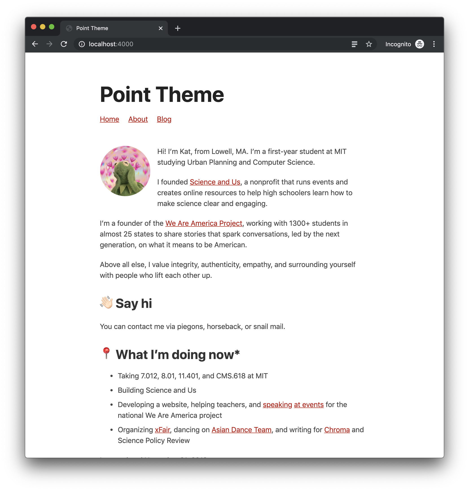

# Point Theme

Point is a [Jekyll](https://jekyllrb.com/) theme for personal websites that are simple and to the point.

Preview: [point-theme.netlify.app](https://point-theme.netlify.app/)

The theme is fully responsive, so it looks good and works on devices of all sizes. All pages are written in [Markdown](https://github.com/adam-p/markdown-here/wiki/Markdown-Cheatsheet) for ease of editing and writing.

To use Point, fork this repo and make your own changes. Be sure to customize the `_config.yml` file, and you can also change colors and fonts in `styles/styles.scss`. Have fun!

This theme uses the [MIT license](https://choosealicense.com/licenses/mit/).

To report a bug or request a feature, please [create an issue](https://github.com/katavie/point-theme/issues).

