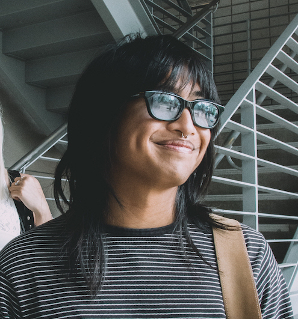

---
---

Hi! I’m Kat, from Lowell, MA. I’m a first-year student at MIT studying Urban Planning and Computer Science.

I founded [Science and Us](https://scienceandus.org), a nonprofit that runs events and creates online resources to help high schoolers learn how to make science clear and engaging.

I’m a founder of the [We Are America Project](https://weareamericaproject.com), working with 1300+ students in almost 25 states to share stories that spark conversations, led by the next generation, on what it means to be American.

Above all else, I value integrity, authenticity, empathy, and surrounding yourself with people who lift each other up.

## 👋🏻 Say hi

You can contact me via piegons, horseback, or snail mail.

## 📍 What I’m doing now*

- Taking 7.012, 8.01, 11.401, and CMS.618 at MIT
- Building Science and Us
- Developing a website, helping teachers, and [speaking](https://hubweek.org) [at events](https://bostonbookfest.org/festival/presenters/) for the national We Are America project
- Organizing [xFair](https://xfair.io), dancing on [Asian Dance Team](https://adt.it.eddu), and writing for [Chroma](https://mitchroma.ink) and Science Policy Review

Last updated November 21, 2019

\* The concept of a “[now page](https://nownownow.com/about” is from Derek Sivers

## 📠 Fun facts

- I use em dashes liberally
- My favorite foods are avocado and ravioli (ideally not together)
- I can do single-leg/pistol squats but am *very* far from being able to do single-arm push ups
- I use [Missive](https://missiveapp.com/) as my email client, Visual Studio Code as my primary text editor (but tumblr.com/customize will always have a special place in my heart), Google Calendar as my calendar, and scrap paper / vim + .txt files for todo lists